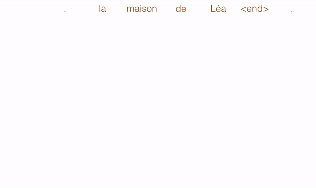
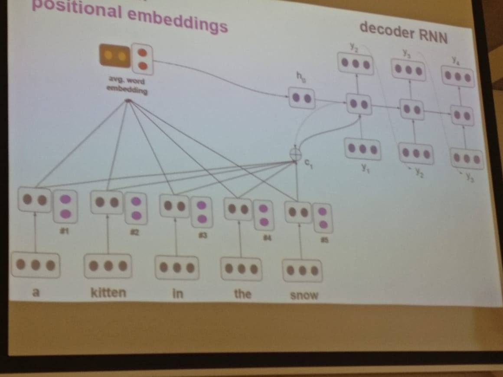
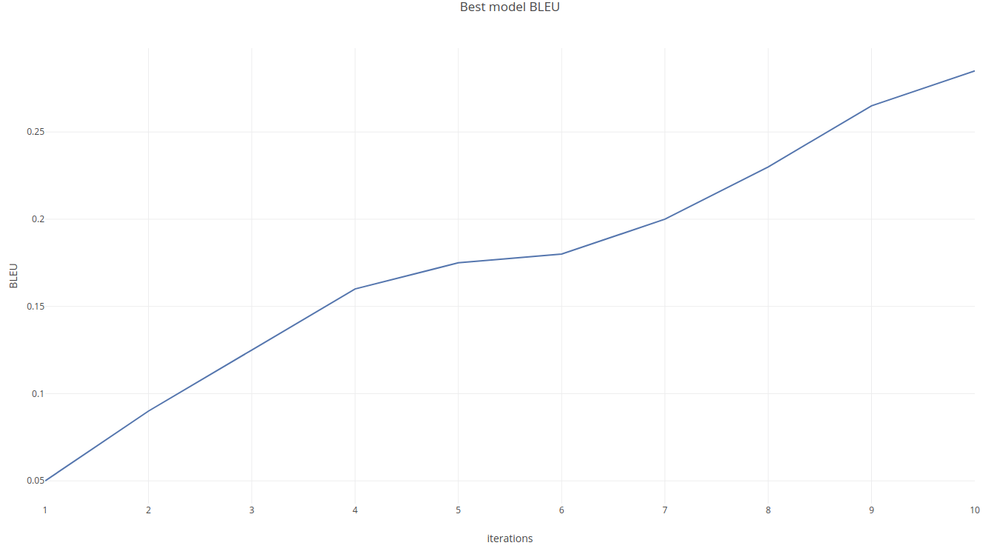

  

# Neural Machine Translation with Attention and Positional Embeddings
This repository contains the corresponding training code for [**the project**](https://www.overleaf.com/read/gndjzfvmgcvt).

Neural Machine Translation (NMT) is an approach to machine translation that uses a large artificial neural network to predict the likelihood of a sequence of words, typically modeling entire sentences in a single integrated model. In this project we attempt to solve the NMT by using a model inspired from the sequence-to-sequence approach. However, instead of encoding the sentence using a Recurrent Neural Network we make use of positional embeddings. We display our findings and draw meaningful conclusions from them.

### Model architecture

  

## Training 
1. Check the [available settings](main.py).
2. Train the networks using the provided [file](main.py):
`python main.py`
## Results 

### BLEU score

  

